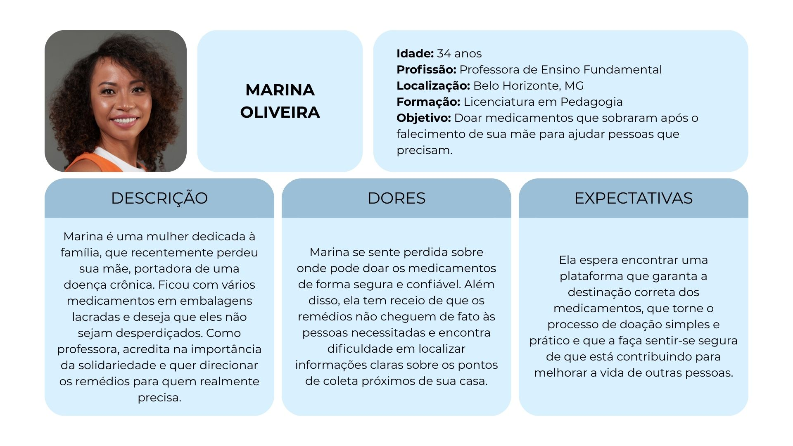
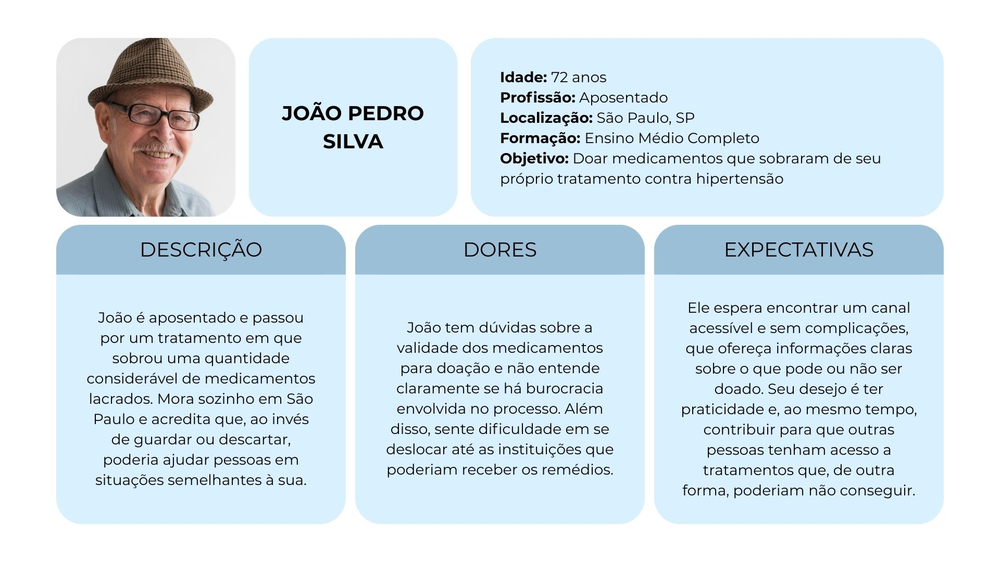
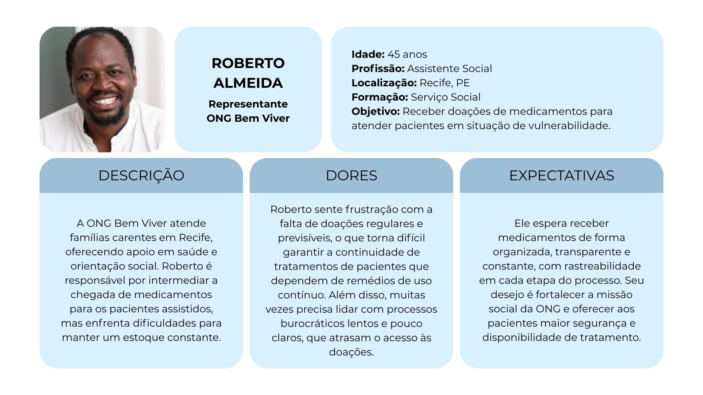
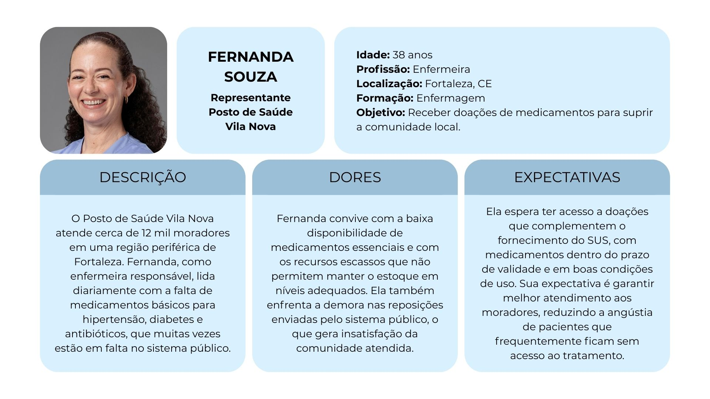
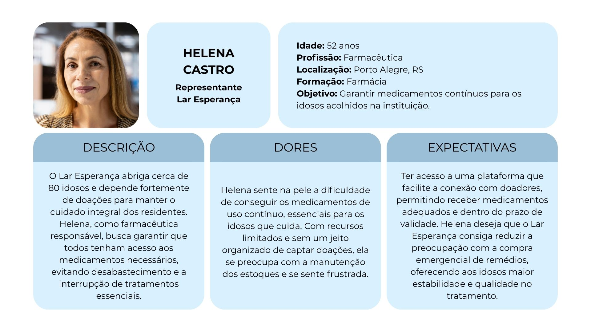

# Especificações do Projeto

Nesta seção estão apresentadas as especificações do projeto, incluindo requisitos funcionais e não funcionais, além das restrições que delimitam a solução. Para as personas, foram considerados aspectos como faixa etária, profissão, objetivos, descrição do problema, dores e expectativas. Também foram elaboradas histórias de usuário para relacionar necessidades e funcionalidades. O diagrama de caso de uso foi construído com o apoio da ferramenta [Astah](https://astah.net/).

## Personas

##

##

##

##

## Histórias de Usuários

Com base na análise das personas foram identificadas as seguintes histórias de usuários:

| EU COMO... `PERSONA`  |  QUERO/PRECISO ... `FUNCIONALIDADE`     | PARA ... `MOTIVO/VALOR`     |
| --------------------- | --------------------------------------- | ---------------------------------------- |
| Marina (Doadora)         | Localizar instituições próximas em um mapa e seleciona-las a fim de doar meus medicamentos          | Ter a certeza de que eles chegarão a quem realmente precisa                 |
| Marina (Doadora)         | Cadastrar medicamentos com informações completas (nome, validade, quantidade, foto e receita digitalizada) | Não correr o risco de doar algo que não será aceito                         |
| João Pedro (Doador)            | Registrar pequenas quantidades de medicamentos para doação                                                 | Não deixar que meus remédios sobrando fiquem guardados sem utilidade        |
| João Pedro (Doador)            | Ter informações objetivas sobre validade e condições de doação ao cadastrar medicamentos                   | Me sentir seguro de que estou fazendo o procedimento corretamente           |
| Roberto (ONG Bem Viver)            | Receber doações de medicamentos e visualizar as listas de doações disponíveis                              | Garantir a continuidade dos tratamentos dos pacientes atendidos             |
| Roberto (ONG Bem Viver)            | Acompanhar de forma transparente o status das doações e receber notificações automáticas                   | Prestar contas às famílias e fortalecer a confiança na instituição          |
| Fernanda (Posto de Saúde Vila Nova) | Gerenciar o recebimento de medicamentos no painel e aprovar/rejeitar doações                               | Complementar o estoque de medicamentos faltantes                            |
| Fernanda (Posto de Saúde Vila Nova) | Receber medicamentos dentro do prazo de validade e em boas condições                                       | Garantir segurança e qualidade no tratamento dos pacientes                  |
| Helena (Lar Esperança)            | Acessar facilmente o histórico de doações e gerar relatórios de impacto                                    | Assegurar que os idosos tenham seus tratamentos garantidos sem interrupções |
| Helena (Lar Esperança)            | Conectar rapidamente com doadores e facilitar o envio de medicamentos                                      | Não depender apenas de recursos financeiros limitados para comprar remédios |

## Requisitos

As tabelas que se seguem apresentam os requisitos funcionais e não funcionais que detalham o escopo do projeto.

### Requisitos Funcionais

|ID    | Descrição do Requisito  | Prioridade |
|------|-----------------------------------------|----|
| RF-01 | A aplicação deve permitir que doadores (pessoa física) e instituições (pessoa jurídica) cadastrem seus perfis.                                                                              | ALTA       |
| RF-02 | A aplicação deve autenticar doadores e instituições por meio de login e senha.                                                                                                              | ALTA       |
| RF-03 | O doador deve cadastrar medicamentos informando nome, validade, quantidade, foto e receita digitalizada (quando aplicável).                                                                 | ALTA       |
| RF-04 | O doador deve visualizar instituições próximas em um mapa com base na geolocalização.                                                                                                       | MÉDIA      |
| RF-05 | O doador deve selecionar uma instituição específica para doar o medicamento.                                                                                                                | ALTA       |
| RF-06 | O doador deve acompanhar o status das suas doações em uma tela dedicada ("Minhas Doações").                                                                                                 | ALTA      |
| RF-07 | A instituição deve listar medicamentos prioritários em status “Escassez critica” visível no painel.                                                                                      | MÉDIA      |
| RF-08 | A instituição deve visualizar a lista de doações disponíveis com informações do doador, medicamento, validade e receita.                                                                    | ALTA       |
| RF-09 | A instituição deve aprovar ou rejeitar doações em até 24 horas.                                                                                                                             | ALTA       |
| RF-10 | A aplicação deve enviar notificações automáticas e lembretes para o doador e a instituição sobre etapas críticas do processo, incluindo decisão de aceite ou recusa e prazos de entrega/análise. | MÉDIA      |
| RF-11 | A instituição deve confirmar o recebimento dos medicamentos no painel.                                                                                                                      | ALTA       |
| RF-12 | A aplicação deve disponibilizar um histórico de doações, listando doações feitas pelo doador e doações recebidas pela instituição.                                                          | BAIXA      |
| RF-13 | A aplicação deve gerar relatórios de impacto com base no histórico de doações.                                                                                                              | BAIXA      |

### Requisitos não Funcionais

|ID     | Descrição do Requisito  |Prioridade |
|-------|-------------------------|----|
|RNF-01| A aplicação deve proteger os dados dos usuários e criptografar a comunicação (HTTPS), em conformidade com a LGPD.| MÉDIA | 
|RNF-02| A aplicação deve oferecer uma interface intuitiva, acessível e de fácil aprendizado. |  ALTA | 
|RNF-03| A aplicação deve ser responsiva, adaptando-se a diferentes dispositivos e funcionar nos principais navegadores web. |  ALTA | 
|RNF-04| A aplicação deve executar as principais operações (como a busca no mapa) em menos de 3 segundos. |  MÉDIA | 
|RNF-05| A aplicação deve manter disponibilidade mínima de 99% para os usuários. | BAIXA | | 

## Restrições

O projeto está restrito pelos itens apresentados na tabela a seguir.

| ID | Restrição                                                                                                             |
| -- | --------------------------------------------------------------------------------------------------------------------- |
| 01 | O projeto deverá ser entregue até o final do semestre.                                                                |
| 02 | O projeto não contará com integração a sistemas de pagamento ou monetização.                                          |
| 03 | O gerenciamento de usuários será simplificado, sem autenticação complexa.                                             |
| 04 | A aplicação não deverá armazenar dados sensíveis de saúde ou informações pessoais além do necessário para uso básico. |
| 05 | O projeto será limitado a uma versão protótipo funcional, sem escalabilidade para uso em larga escala.                |
| 06 | Não haverá integração logistica (coleta/entrega)                                                                      |
| 07 | Sem integração com serviços de verificação de receita                                                                 |

## Diagrama de Casos de Uso

