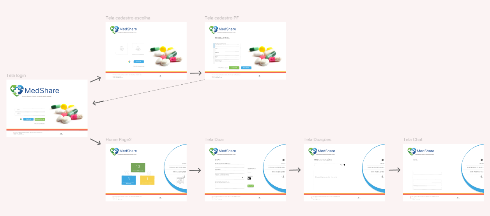
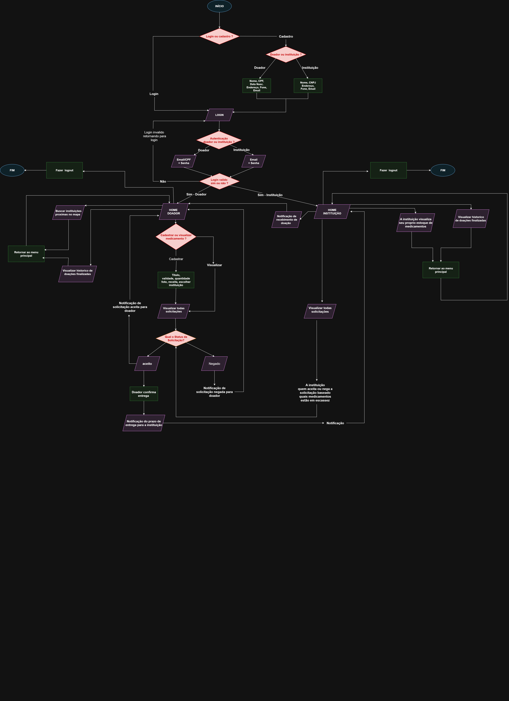

# Projeto de Interface
---

## User Flow

O protótipo interativo de telas está disponível no <a href="https://marvelapp.com/prototype/34hgcbf6/screen/97876723">ambiente MarvelApp</a>. Nesse ambiente está o protótipo do usuário pessoa física.

Há dois fluxos, um para pessoa física que mostra a funcionalidade principal de fazer doações, outro para pessoa jurídica que mostra a funcionalidade principal de buscar doações.

### Pessoa Física

- Login → Cadastro PF → Login → Home Page → Doar → Minhas Doações → Chat

### Pessoa Jurídica

## Diagrama de Fluxo

O diagrama abaixo representa **todo o fluxo de navegação e interações** da aplicação **MedShare**. Ele mostra de forma visual os caminhos que **doadores (Pessoa Física)** e **instituições (Pessoa Jurídica)** percorrem dentro do sistema, desde o login até as ações principais.

### Estrutura Geral

**Login/Cadastro**: ponto inicial do fluxo, onde o usuário escolhe se vai entrar como **Doador (PF)** ou **Instituição (PJ)**.  
**Home Page**:
**Home Doador**: para pessoas físicas que irão cadastrar e gerenciar doações.
**Home Instituição**: para instituições que irão buscar e solicitar doações.
- **Funcionalidades específicas**:
**Doador (PF)**  
    - Cadastrar novas doações  
    - Visualizar doações cadastradas  
    - Receber notificações de solicitações  
    - Confirmar entregas  
    - Interagir via chat com instituições
**Instituição (PJ)**  
    - Pesquisar e solicitar doações disponíveis  
    - Visualizar histórico  
    - Receber notificações de status e prazos  
    - Interagir via chat com doadores

### Elementos Visuais do Diagrama

**Losangos rosa**: pontos de decisão ou bifurcação (ex.: escolha do tipo de usuário, aceitar ou negar solicitação).  
**Retângulos verdes**: ações finais ou confirmações (ex.: fazer logout, confirmar entrega).  
**Retângulos roxos**: telas e ações intermediárias (ex.: Home Doador, Home Instituição, Notificações, Visualizar doações, Chat).  
**Setas**: indicam o fluxo de navegação e de notificações entre doador e instituição.  

Obs: Abrir o projeto direto no https://app.diagrams.net/

## Wireframes

Estas telas fazem parte do fluxo do usuário **Pessoa Física (PF)** no MedShare

### Home Page

- **Objetivo:** servir como hub principal para o doador. 
  **Elementos:**
   Contadores de status:  
   🟩 **Total de medicamentos doados**
   🟦 **Medicamentos disponíveis para doação**
   🟨 **Medicamentos pendentes** (Precisam de alguma correção nas informações)
  - Menu lateral com ações principais:  
     **Doar** (cadastrar uma nova doação)  
     **Buscar Instituições** (pesquisar instituições interessadas)  
     **Minhas Doações** (visualizar doações cadastradas)  
  - Menu do usuário (ícone no canto):
     **Notificação**  
     **Chat**  
     **Relatório**  
     **Editar Perfil**  
     **Sair**  

---

### Tela Doar

**Objetivo:** permitir que o doador cadastre uma nova doação de medicamento.  
**Principais campos:** nome do medicamento, quantidade, validade, observações, botão de envio.

---

### Tela Minhas Doações

**Objetivo:** listar e gerenciar as doações já cadastradas pelo usuário.  
**Funcionalidades:** visualizar status, acompanhar solicitações de instituições, editar ou cancelar doações se necessário.

---

### Tela Chat

**Objetivo:** possibilitar comunicação direta com as instituições que solicitaram determinada doação.  
**Funcionalidades:** troca de mensagens em tempo real, acompanhamento do status da solicitação.

---

### Tela Notificação

**Objetivo:** centralizar os avisos do sistema (novas solicitações, prazos de entrega, atualizações de status).  
**Funcionalidades:** listar notificações recebidas, marcar como lidas, acessar rapidamente a doação ou solicitação correspondente.

