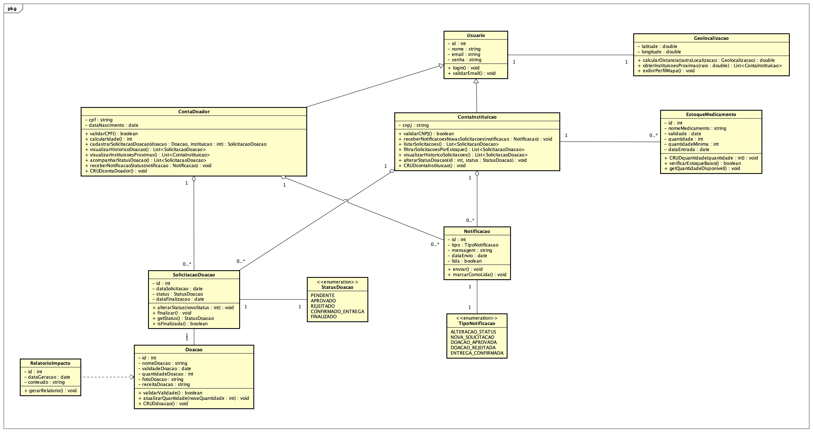
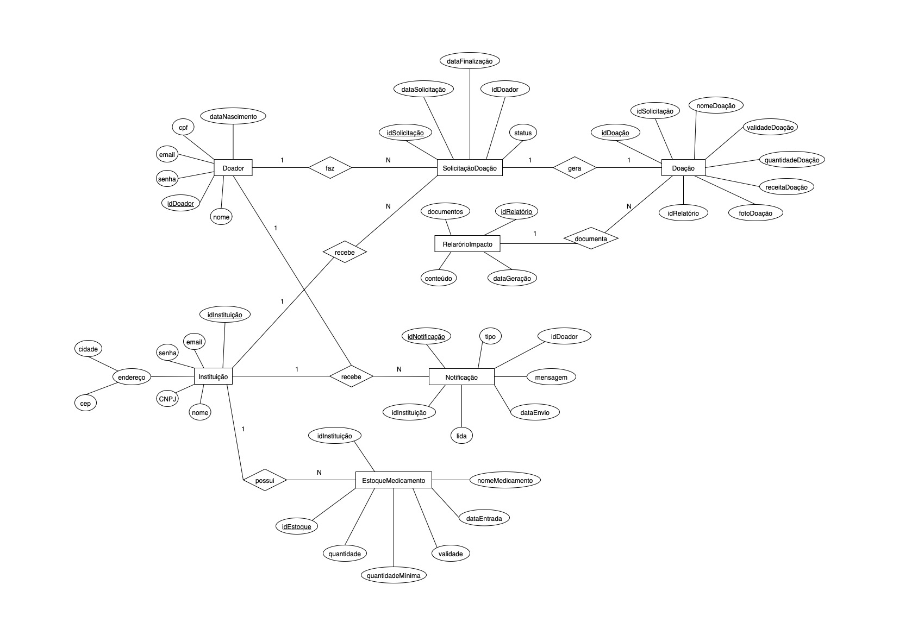
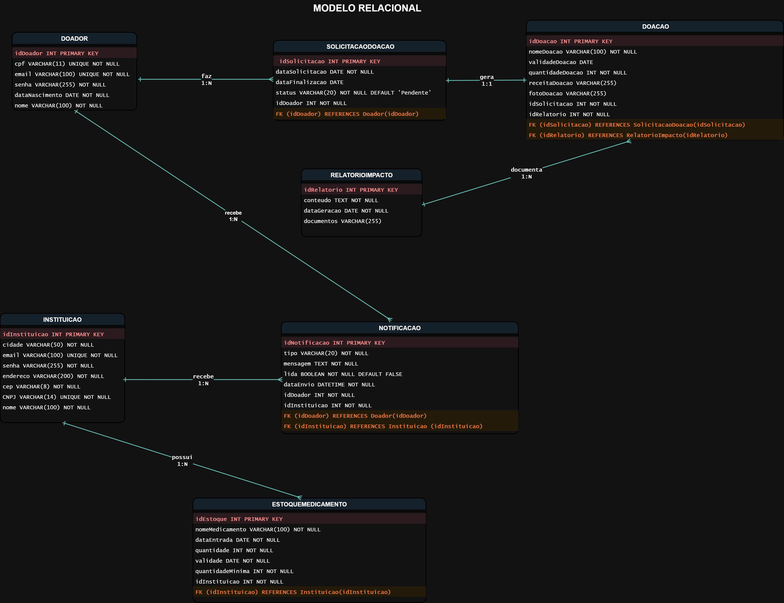

# Arquitetura da Solução

O software será estruturado segundo a **arquitetura MVC** (Model-View-Controller), composta por três camadas principais:

- **Model:** responsável pela interação com o banco de dados por meio do Entity Framework, baseado no projeto conceitual MER e no diagrama de classes.
- **View:** responsável pela interface com o usuário, fornecendo páginas dinâmicas para interação.
- **Controller:** gerencia o fluxo entre as camadas, processando as regras de negócio e retornando as respostas.

A hospedagem da aplicação e do banco de dados será realizada na nuvem, garantindo disponibilidade e escalabilidade.

## Diagrama de Classes

O diagrama de classes ilustra graficamente como será a estrutura do software, e como cada uma das classes da sua estrutura estarão interligadas. Essas classes servem de modelo para materializar os objetos que executarão na memória.

## Modelo ER (Projeto Conceitual)

O Modelo ER representa através de um diagrama como as entidades (coisas, objetos) se relacionam entre si na aplicação interativa.

## Projeto da Base de Dados

O projeto da base de dados corresponde à representação das entidades e relacionamentos identificadas no Modelo ER, no formato de tabelas, com colunas e chaves primárias/estrangeiras necessárias para representar corretamente as restrições de integridade.

## Tecnologias Utilizadas

A solução será desenvolvida utilizando **C# como linguagem principal**, com o **Entity Framework** para o mapeamento objeto-relacional (ORM), garantindo produtividade no acesso e manipulação de dados. O projeto seguirá o **padrão arquitetural MVC**, proporcionando separação de responsabilidades, manutenção facilitada e escalabilidade.

As ferramentas empregadas no projeto são:

- **Visual Studio Code:** editor de código utilizado para desenvolvimento de front-end (HTML, CSS, JavaScript) e edição de arquivos de configuração, com suporte a extensões e integração com GitHub.
- **Visual Studio (VS):** utilizado principalmente para o desenvolvimento da aplicação back-end em .NET, aproveitando o suporte completo a C# e integração com depuração e testes.
- **GitHub:** central para controle de código, versionamento e revisão por pull requests.
- **Figma:** utilizado para a criação da interface e validação visual.
- **Astah/Draw.io:** aplicados para elaboração de diagramas UML e BPMN.

## Hospedagem

O sistema será hospedado na nuvem, assim como o banco de dados.
